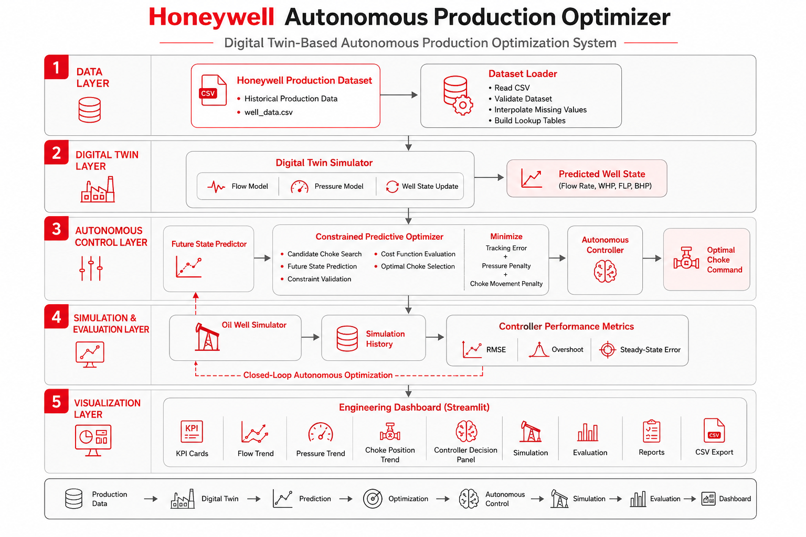
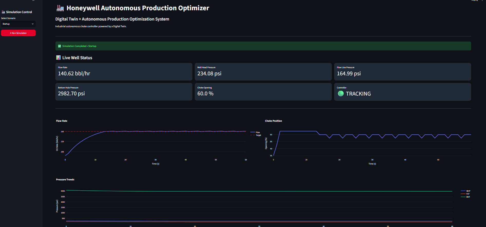

# 🏭 Honeywell Autonomous Production Optimizer

### Digital Twin-Based Autonomous Production Optimization System

<p align="center">


</p>

---

## 📖 Overview

The **Honeywell Autonomous Production Optimizer** is a Digital Twin-based autonomous control system developed for the Honeywell Hackathon.

Using historical production data, the system simulates oil well behaviour and automatically determines the optimal choke position required to achieve a desired production target while maintaining safe operating conditions.

The project integrates a Digital Twin, predictive optimization, autonomous control, engineering evaluation, and an interactive dashboard into a modular software architecture.

---

## 🏗️ System Architecture

<p align="center">
    
</p>

The system follows a layered architecture that combines data-driven simulation, predictive optimization, autonomous control, performance evaluation, and visualization to optimize oil well production while respecting operational safety constraints.

---

## ✨ Key Features

| Feature | Description |
|----------|-------------|
| 🏭 Digital Twin | Dataset-calibrated oil well simulator |
| 🧠 Autonomous Controller | Automatic choke control |
| ⚙️ Predictive Optimizer | Cost-based constrained optimization |
| 🛡️ Safety Constraints | Rejects unsafe operating points |
| 📊 Engineering Dashboard | Live KPIs, trends and controller insights |
| 📈 Performance Metrics | RMSE, Overshoot and Steady-State Error |
| 📂 Reports | CSV export and simulation reports |
| 🧪 Scenario Testing | Startup, Target Tracking and Impossible Target |

---

## 📊 Engineering Dashboard

<p align="center">
    
</p>

The Streamlit dashboard provides a real-time view of the autonomous production system, including:

- Live KPI Cards
- Flow & Pressure Trends
- Choke Position Tracking
- Controller Decisions
- Performance Metrics
- Report Downloads

---

## 🧪 Simulation Scenarios

| Scenario | Objective |
|----------|-----------|
| 🚀 Startup | Stabilize production from initial conditions |
| 🎯 Target Tracking | Follow changing production targets |
| ⚠️ Impossible Target | Demonstrate safe constrained operation |

---
## 📊 Results

The controller performance is evaluated using standard engineering metrics collected during simulation.

| Metric | Description |
|---------|-------------|
| RMSE | Root Mean Square Error |
| Overshoot | Maximum production overshoot |
| Steady-State Error | Final tracking error |
| Maximum Error | Worst tracking deviation |

### Validation Summary

| Scenario | Status |
|----------|:------:|
| 🚀 Startup | ✅ PASS |
| 🎯 Target Tracking | ✅ PASS |
| ⚠️ Impossible Target | ✅ PASS |

---

## 📁 Project Structure

```text
Honeywell-Hackathon/
│
├── controller/
├── dashboard/
│   ├── components/
│   └── styles/
├── data/
├── docs/
│   └── images/
├── evaluation/
├── results/
├── scenarios/
├── simulator/
├── tests/
├── utils/
├── visualization/
│
├── benchmark.py
├── config.py
├── main.py
├── requirements.txt
└── README.md
```

---

## 🚀 Quick Start

Clone the repository

```bash
git clone https://github.com/belkoniakhil/Honeywell-Hackathon.git
cd Honeywell-Hackathon
```

Install dependencies

```bash
pip install -r requirements.txt
```

Run the simulator

```bash
python main.py
```

Launch the dashboard

```bash
python -m streamlit run dashboard/app.py
```

Open your browser:

```text
http://localhost:8501
```

---

## 🛠️ Technology Stack

| Category | Technology |
|----------|------------|
| Language | Python 3.14 |
| Dashboard | Streamlit |
| Visualization | Plotly, Matplotlib |
| Data Processing | Pandas, NumPy |
| Simulation | Digital Twin |
| Optimization | Constrained Predictive Optimization |
| Version Control | Git & GitHub |

---

## 🚀 Future Enhancements

- Multi-well production optimization
- Multi-step prediction horizon
- Real-time SCADA integration
- Online model calibration
- AI-assisted production forecasting
- Cloud deployment

---

## 👨‍💻 Author

**Akhil Kumar Belkoni**

B.Tech – Computer Science & Engineering

Jawaharlal Nehru Technological University Hyderabad (JNTUH)

- GitHub: https://github.com/belkoniakhil
- LinkedIn: *(Add your LinkedIn profile)*

---

## 📜 License

This project was developed for the **Honeywell Hackathon** as an educational and demonstration project.

---

<p align="center">
⭐ If you found this project useful, consider giving it a star!
</p>
